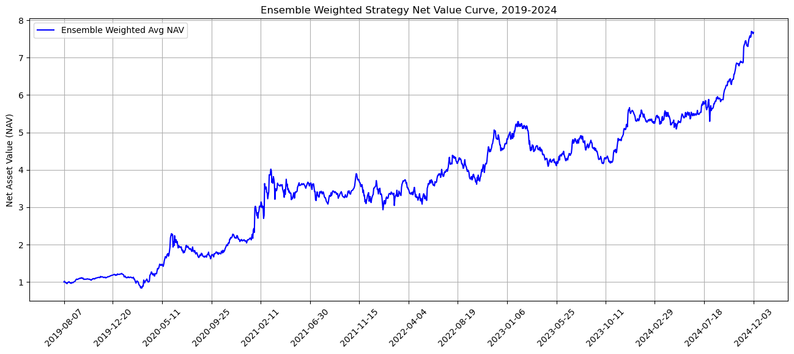

# A Novel Loss Function for Deep Learning Based Daily Stock Trading System

This git repository includes the code used for the paper "A Novel Loss Function for Deep Learning Based Daily Stock Trading System" by Ruoyu (Tony) Guo, Haochen Qiu, and Xuelun (Alan) Hou. This study attempts to bring new ideas in cross-sectional asset pricing problems. We introduce a novel return-weighted loss function to train deep learning algorithms to detect top growth opportunities. Comparing with linear regression methods and traditional loss functions, we demonstrate the superiority of our novel loss function by simulating portfolio returns, drawdown analysis, and $t$-tests. This page will be continuously updated. Please refer to the paper for more details.

The paper is currently available on arxiv (https://arxiv.org/abs/2502.17493) and is submitted for publication.

## Novel Loss Function

The study is done on two time periods roughly from 2005-2010 and 2019-2024. They intentionally include the 2008 financial crisis and the 2020 COVID pandemic. Use `download_and_process_raw_data_yfinance.ipynb` to download data from Yahoo Finance starting with a preliminary set of stocks and process the data. We only include the code and report the result in the later time period 2019-2024 on this page. 

Cross-entropy is a common loss function for classification tasks. If $y_{\text{true}}, y_{\text{pred}}$ have probability distributions $p_i$ and $q_i$, respectively, then the cross-entropy of the true distribution relative to the predicted distribution is defined as 

$$\text{CE}(y_{\text{true}}, y_{\text{pred}}) =  \sum_i p_i \log q_i.$$

Roughly speaking, the novel loss function adds a weight to the cross-entropy formula based on each individual stock's next day return so that models trained with it will focus on detecting patterns leading to breakouts and breakdowns. The definition of the new loss is 

$$\mathrm{loss} = \mathrm{CE}(y_{\text{true}}, y_{\text{pred}}) * |r_{\text{cap}}|,$$

where $r_{\text{cap}}$ is the next day percentage return capped at 50%.

## Portfolio Performance

We backtest the model performance over 1360 trading days (~5.4 years) and use the simple trading strategy of investing in the top 10 stocks each model recommends per day. We compare the novel loss function's performance against Mean Squared Error (MSE) and Cross-entropy (CE) loss. Best linear regression method and equal-weighted market benchmark are also included. The CNN portfolios reported are mixture-of-experts ensembles with dynamic weighting based on historical performance.

We also combine 8 mixture-of-experts ensembles in equal-weighted manner to increase the portfolio holding capacity multiple times without sacrificing the Sharpe Ratio (SR) significantly.

## $t$-test
In the 2019-2024 period, CNN equipped with the novel loss function is the only model showing statistically significant return compared to equal-weighted market benchmark.

## Model Architecture
The CNN and attention model architecture equipped with the novel loss is below. Please refer to the paper for details.

